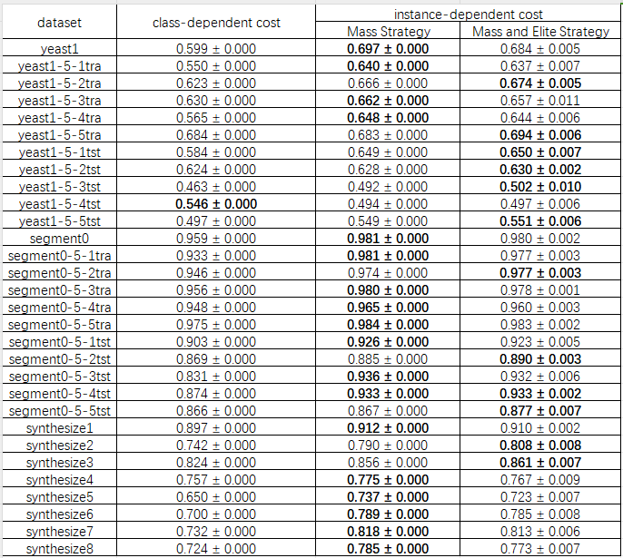

# Instance-dependent Cost Based Online Imbalance Classification
 This repository is for SUSTech CS326 Group Project Ⅱ. We are solving online imbalance classification based on instance-dependent cost.

`12/13`: proposed MSIC.

`12/20`: proposed MAESIC.

`12/22`: random makes difference since $\rho$ is a random number $\in [0, 1]$.

`12/27`: run on *yeast* (11), *segment* (11), *synthesize* (8) datasets 10 times independently.

`12/28`: compare MSIC (18) with MAESIC (12): **MSIC is slightly better**.

`12/29`: What else? How about...?
